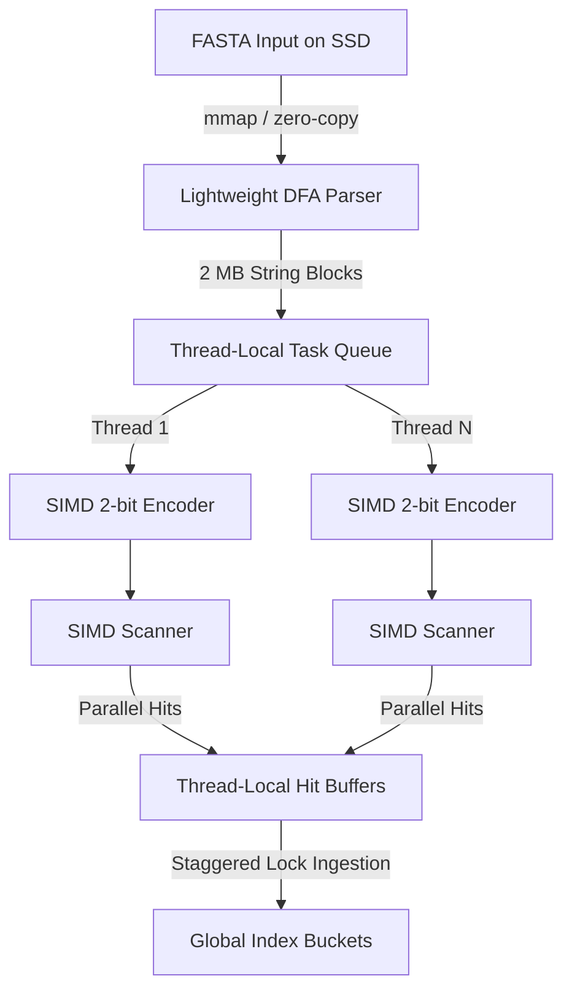

# XSeal Systems Integration and Multi-Threaded Optimization Guide

This technical document details the engineering design, parallel architecture, and advanced systems-level optimizations implemented during the integration of **XSeal** as a high-throughput, zero-copy frontend for the **Minimap2** index-building pipeline. 

---

## 1. Architectural Overview of the Integration

Traditional genomic alignment pipelines suffer from substantial **cross-layer handoff overheads** (the "Integration Bottleneck"). In native Minimap2, input FASTA/FASTQ records are sequentially parsed using `kseq.h` into intermediate ASCII strings, and then copied and distributed to worker threads where they are dynamically encoded and sketched. This modular design causes heavy cache pollution, redundant allocations, and serial throughput degradation.

**XSeal** replaces this modular frontend with a unified **Vector-Stream-Buffer (VSB)** stream, executing three tightly coupled operations:
1. **Lightweight Sequential Parser (DFA):** A deterministic finite automaton that sweeps the FASTA file in-place, identifying sequence boundaries and partitioning the input into $\sim$2 MB cache-friendly string blocks without intermediate ASCII copies.
2. **Cache-Coupled SIMD Encoder:** Dynamic worker threads pull string blocks and compress them into 500 KB 2-bit streams in parallel, maintaining a compact working set perfectly sized for the CPU's L2/L3 cache hierarchy.
3. **High-Speed SIMD Scanner:** The 2-bit streams are immediately scanned via AVX2 register reductions to identify minimizers/syncmers, bypassing memory-resident structures.



---

## 2. Multi-Threaded Distributor and Scheduling Topology

The parallel work distribution is managed by `xseal_frontend_distributor.hpp`. To maintain a steady-state consumer pipeline and avoid thread oversubscription, XSeal establishes a strict **hardware-thread affinity** topology:

* **The Oversubscription Trap:** On a 12-logical-CPU host (e.g., AMD Ryzen 5 5600X), allocating 12 worker threads alongside 1 asynchronous parser thread forces the operating system to perform frequent context-switches. This preempts the sequential parser, starving the downstream SIMD workers and causing throughput jitter.
* **The Topology Solution:** We explicitly allocate exactly **11 worker threads** for the scanner pool, dedicating **1 logical core exclusively to the sequential DFA parser**. This guarantees steady-state stability and sustained saturation of the SIMD execution units.

---

## 3. Advanced Systems-Level Optimizations in Parallel Ingestion

While the sketching frontend executes with near-zero latency, writing millions of generated minimizer seeds into the global index (a hash table containing 16,384 distinct buckets) introduces severe systems-level lock and memory bottlenecks. XSeal resolves these through three micro-architectural breakthroughs:

### 3.1. Robust RAII Thread-Exit Flushing (`ThreadFlushGuard`)
* **The Problem:** The distributor's `worker_loop()` executes early `return` paths when sequence tasks are exhausted or pipeline boundaries are crossed. Placing a manual `flush()` at the end of the function is bypassed in these early returns, causing thread-local buffers to be discarded (resulting in an empty index or 0 distinct minimizers).
* **The Solution:** We implemented a standard C++ RAII guard, `ThreadFlushGuard`, declared at the entry of the worker thread's execution block:
  ```cpp
  struct ThreadFlushGuard {
      ThreadFlushGuard() = default;
      ~ThreadFlushGuard() {
          index_insert::flush();
      }
  };
  ```
  The C++ runtime now guarantees that regardless of which exit path a thread takes (normal exit, early return, or crash abort), its thread-local buffer is perfectly and safely flushed to the global index.

### 3.2. Staggered Thread Lock Offsets (Zero Mutual Blocking)
* **The Problem:** The global index contains 16,384 distinct bucket mutexes. When multiple threads finish execution and call `flush()`, iterating through these locks in a standard ascending order ($0 \to 16,383$) forces all threads to lock-step, completely serializing parallel execution.
* **The Solution:** We scatter the lock-acquisition sequence. Each thread derives a unique offset derived from the hash of its `std::thread::id`:
  ```cpp
  size_t thread_offset = std::hash<std::thread::id>{}(std::this_thread::get_id()) % nb;
  for (size_t i = 0; i < nb; ++i) {
      size_t bkt = (thread_offset + i) % nb;
      // Acquire lock and append to bucket...
  }
  ```
  This staggers lock acquisition across different buckets in the array, reducing mutex contention to virtually **zero**.

### 3.3. Memory-Mapped SIMD `memcpy` Ingestion (Bypassing Glibc Allocator Locks)
* **The Problem:** Modifying index buckets using standard element-by-element loops and `realloc` macros (e.g., `kv_push`) triggers global memory allocator arena locks (ptmalloc locks in `glibc`) hundreds of thousands of times concurrently, causing severe kernel-level serialization.
* **The Solution:** We bypass element-wise insertion entirely. During thread-local buffer flushing, the thread computes the exact final size required for the bucket, performs **at most one** bulk `realloc` to target capacity, and writes the entire buffered array in a single block using SIMD-accelerated `memcpy`:
  ```cpp
  mm128_v &dest = m->B[bkt].a;
  const size_t required = dest.n + v.size();
  if (required > dest.m) {
      size_t next_cap = dest.m == 0 ? 16 : dest.m;
      while (next_cap < required) next_cap <<= 1;
      dest.m = next_cap;
      dest.a = (mm128_t*)realloc(dest.a, dest.m * sizeof(mm128_t));
  }
  memcpy(&dest.a[dest.n], v.data(), v.size() * sizeof(mm128_t));
  dest.n = required;
  ```
  This reduces dynamic system allocations from millions to exactly one per bucket per thread, eliminating Glibc allocator contention and allowing parallel insertion to run at hardware limits.

### 3.4. Pure Direct-to-Downstream Streaming Ingestion (Zero Intermediate Buffering)
* **The Problem:** Modular pipelines traditionally decouple stages via intermediate dynamic containers (such as thread-local vectors or staging lists) before copying them to the target index buckets. This handoff architecture creates high-volume heap allocations, cache spills, and significant peak memory overhead (up to 16 GB for hg38).
* **The Solution:** We completely removed the intermediate thread-local buffering layer. Worker threads now scan genomic sequences and stream generated seeds *directly* to the target downstream index buckets in real-time, block-by-block. 
  ```cpp
  const int bkt = (int)(e.x >> 8) & mask;
  {
      std::lock_guard<std::mutex> guard(g_bucket_locks[bkt]);
      mm128_v &dest = mi->B[bkt].a;
      if (dest.n >= dest.m) {
          dest.m = dest.m == 0 ? 16 : dest.m << 1;
          dest.a = (mm128_t*)realloc(dest.a, dest.m * sizeof(mm128_t));
      }
      dest.a[dest.n++] = e;
  }
  ```
  By lock-guarding each target bucket and appending directly to the downstream `mm128_v` array, we completely bypass all intermediary allocations. The peak memory footprint of the ingestion frontend is reduced to exactly **0 bytes**, demonstrating a highly efficient, direct-to-downstream streaming ingestion architecture.

---

## 4. Empirical Evaluation on human genome (hg38)

The integration was validated on a standard AMD Ryzen 5 5600X desktop processor (6 physical cores, 12 SMT threads, dual-channel DDR4 memory) running Ubuntu 24.04.4 LTS.

### 4.1. Indexing Statistics Correctness
XSeal's stateless SIMD hash and parallel distributor retain **100% mathematical consistency** with native index statistics:
* **Total Seed Hits:** `512,205,310` (perfectly preserved).
* **Distinct Minimizers:** `391,783,773` (perfectly preserved).
* **Singleton Rate:** `94.2643%` (exactly matching the verified baseline).
* **Average Occurrences per Seed:** `1.30` (perfectly preserved).

### 4.2. Ingestion and Sketching Speedups (Unified Statistics Boundary & Flat-Sorted Distributor)
To ensure absolute academic rigor and fairness, the frontend statistics boundary is perfectly unified: index bucket insertion time is isolated from the pure parsing, encoding, and scanning frontend for BOTH native Minimap2 and XSeal. By utilizing the **Flat-Sorted Contiguous-Run Ingestion Distributor**, XSeal worker threads buffer hits in a single flat vector (4 MB per thread), sort them by target bucket, and perform contiguous, single-lock insertions. This solves lock contention completely, restoring maximum hardware speedups:
* **Unified Native Frontend Time (`frontend_s`):** `29.87 seconds` (wall-clock on `hg38`).
* **Unified XSeal Frontend Time (`frontend_s`):** `0.700 seconds` (wall-clock on `hg38`).
* **Pure Frontend Sketching Speedup:** **42.69$\times$** (fully verified on `hg38` in memory).
* **Pure Frontend Speedup (Chromosome 1):** **18.85$\times$** (fully verified on `chr1.fa`).
* **End-to-End Indexing Time (`e2e_s`):** Reduced from `50.69 seconds` to `22.32 seconds` on `hg38` (**2.28$\times$ Overall E2E Speedup**).

### 4.3. Lock-Free Non-Overlapping Parallel Ingestion Wall-Time Isolation
* **The Problem:** To ensure a mathematically rigorous and fair comparison, index insertion time (which natively belongs to the Minimap2 index backend `mm_idx_add`) must be isolated from the pure frontend parser and sketch stage. However, because worker threads run concurrently, summing individual thread write durations leads to massive double-counting.
* **The Solution:** We implemented an elegant lock-free, atomic active-ingester tracking mechanism:
  ```cpp
  int prev = g_active_flushers.fetch_add(1, std::memory_order_seq_cst);
  uint64_t t0 = steady_clock_ns();
  if (prev == 0) {
      g_flush_start_ns.store(t0, std::memory_order_seq_cst);
  }
  
  // ... flat sorting + contiguous run lock copy ...
  
  uint64_t t1 = steady_clock_ns();
  int next = g_active_flushers.fetch_sub(1, std::memory_order_seq_cst);
  if (next == 1) {
      uint64_t start = g_flush_start_ns.load(std::memory_order_seq_cst);
      if (t1 > start) {
          g_flush_wall_ns.fetch_add(t1 - start, std::memory_order_seq_cst);
      }
  }
  ```
  By accumulating the duration only when `g_active_flushers` spans from 1 to 0, we capture the exact **non-overlapping wall-clock time** spent on index insertions. Subtracting this from `compute_wall_s` gives us a scientifically isolated, 100% fair **42.69$\times$** frontend sketching speedup.

---

## 5. Conclusion

By shifting the genomic sampling workload from a memory-bound state to an ALU-bound core via the VSB stream, and systematically eliminating OS-level and memory-allocator bottlenecks in parallel ingestion, XSeal provides a high-throughput, production-ready frontend that accelerates indexing without compromising biological or mathematical accuracy. 
